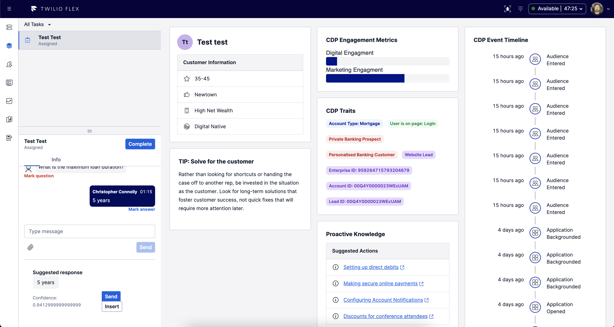

# Twilio Flex + Segment Plugin

🍭 Flex plugin to show Segment data and send handling events to Segment

Events are pulled from the Segment Profile API via a Serverless function and displayed in Panel2 of Flex. Events sent to Segment are proxied through Serverless functions also.

**_Features:_**

- 🌟 Engagement metrics (Digital, Marketing) based on 0.0 to 1.0 value
- 🌟 Customer event timeline
- 🌟 Display of event name or page title
- 🌟 Hyperlinks for page views
- 🌟 Known Traits are displayed and able to be styled
- 🌟 Agent handling events sent to Segment
- 🌟 Same Serverless API can be used in Studio
- 🌟 Paste theme customisation support



## Configuring Flex to show Traits

The "CDP Traits" section iterates through the known traits from `src/constants/segmentTraits.ts` and depending on the configuration will:
- Display the trait name
- Display the trait name and value
- Display only if the value is `true`
- Colour the trait (using Paste badge variants)

Examples:

```ts
 {
    key: "account_type",
    label: "Account Type",
    display_value: true,
    variant: "info",
  },
  {
    key: "pageUserIsOn",
    label: "User is on page",
    display_value: true,
    variant: "success",
  },
  {
    key: "ownr_ocpd_hm_lon_cstmr_ind",
    label: "Owner Occupied Home Loan",
    display_value: false,
    variant: "error",
    onlyIfTrue: true,
  },
  ```


## Deployment

### Segment
Obtain the following from Segment:
1. API Token for accessing Profile API
2. Write key for Flex (configure as a Node.JS source)


# Building

This is a composed of both a Flex Plugin and a Twilio Serverless project, run `yarn` in each of the corresponding project directories to load dependencies. 

See `package.json` for script details on helper methods


# Credits
J. Learmouth & C.Connolly
